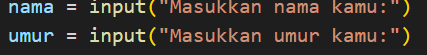
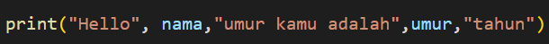
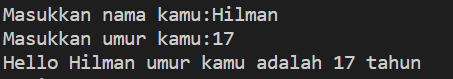
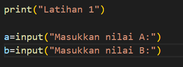
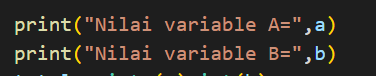
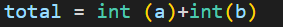
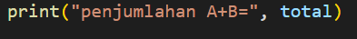
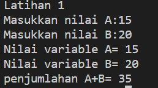
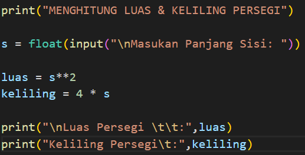

# Tugas Python

## Tutorial Membuat Program Python

### Membuat Program Latihan dan Mencari Keliling Persegi

1. Kita buat folder di pc kita  
2. Kita ketik Python.py 
3. Lalu kita masuk ke File python.py menggunakan ekstrak aplikasi masing masing, disini saya menggunakan Visual Studio Code 
4. Kita akan membuat Program untuk menginput Data Diri User  
  
5. Lalu langkah selanjutnya adalah membuat print atau untuk mencetak nanti di program python  
  
6. Contoh yang akan tampil di program seperti ini  
  
7. Langkah selanjutnya kita akan membuat program nya yaitu, contoh kita print "Latihan 1"  dan kalian buat rumus nya supaya user bisa menginput nilai yang dia mau  
  
8. Selanjutanya kita akan print programnya seperti ini  
  
9. Selanjutnya kita akan memasukan total untuk menjumlahkan program yang kalian buat  
  
10. Selanjutnya kita print penjumlahan dari program tersebut  
  
11. Dan ini hasil dari program yang kita buat  
  
12. Selanjutnya kita membuat program Menghitung Luas & Keliling persegi
  
13. Dan ini hasilnya setelah kita RUN  
  
     

<i>sekian tutorial singkat ini saya ucapkan terima kasih, semoga bermanfaat</i>
